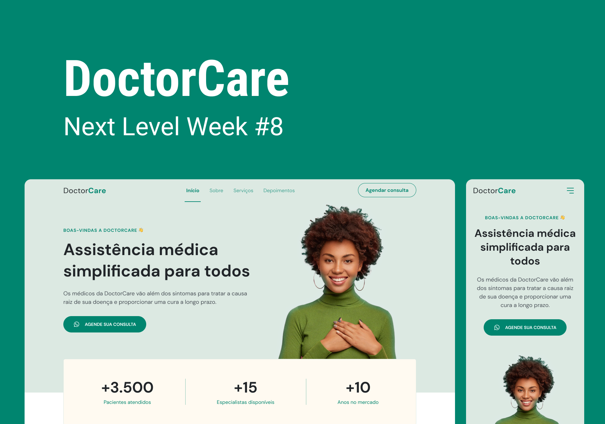

<h1 align="center">Doctorcare Application</h1>

 

<h1>📌Description</h1>

Application created during Rocketseat's NLW Return in 2022 | Developed for medical clinic to attract and close appointments with new clients.

 

<h1>📌Technologies</h1>
<ul>
  <li>HTML</li>
  <li>CSS3</li>
  <li>JavaScript</li>
</ul>
 

<h1>📌Libraries</h1>
<ol>
  <li>Google Fonts</li>
  <li>Scroll Reveal</li>
</ol>
 

<h1>📌Updates</h1>
[✔] Changed site colors. 
[✔] Add testimonials section. 
[✖] Add a create testimonials button. 
[✖] Create preview page for all testimonials. 
[✖] Add Google Maps map via API 

<h1>📌Authors</h1>

| [ Fabio Barbosa](https://github.com/fab1obarbosa)
 
